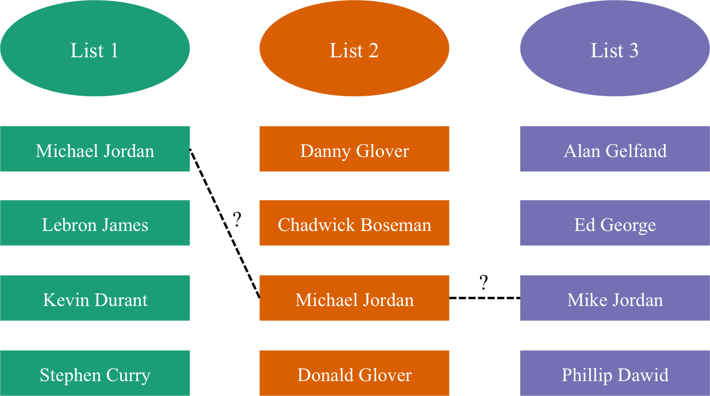
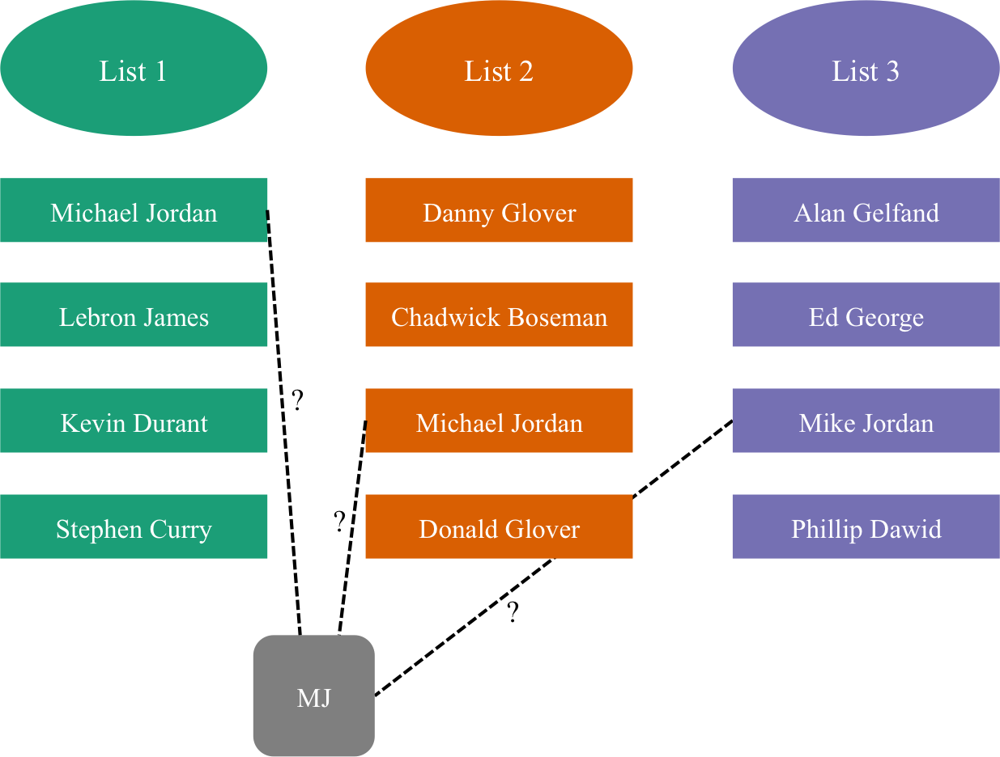

```{r setup, include=FALSE}
options(htmltools.dir.version = FALSE)
```

```{r libraries, echo=FALSE, message=FALSE, warning=FALSE}
library(knitr) # tables
library(ggplot2) # plots
library(readr) # read data
library(dplyr) # data manipulation
library(tidyr) # data manipulation
library(charlatan) # make fake data
library(salty) # distort data
library(kableExtra) # fancy tables
library(xtable)
library(gridExtra)
library(representr) # prototyping
library(gganimate)

opts_chunk$set(echo=FALSE, message=FALSE, warning=FALSE) # don't print code etc.
opts_knit$set(self.contained = FALSE)
theme_set(theme_bw(base_family = "serif", base_size = 20)) # black and white theme plots

set.seed(4321) # reproducible
```

```{r load_refs}
library(RefManageR)

BibOptions(check.entries = FALSE,
           bib.style = "authoryear",
           cite.style = "authoryear",
           style = "markdown",
           hyperlink = TRUE,
           dashed = FALSE)

bib <- ReadBib("./refs.bib", check = FALSE)
```

class: center, middle

# About Me

### Assistant Professor at CSU
### From: Houston, TX
### Pronouns: She/Her

---
background-image: url(https://www.utexas.edu/sites/default/files/styles/utexas_hero_photo_image/public/hero-photos/maincampus_hero.jpg?itok=ZkKrhFki)

# 

### BS in Mathematics from The University of Texas at Austin
### MA in Mathematics from The University of Texas at Austin

???

Image credit: [UT Austin](https://www.utexas.edu/about/overview)


---
background-image: url("images/kaplan_nordman_isu.jpg")
background-position: center
background-size: contain
class: inverse, bottom, right

# 

### MS in Statistics from Iowa State University
### PhD in Statistics from Iowa State University

---
background-image: url("https://upload.wikimedia.org/wikipedia/commons/6/6c/DukeChapelMorning.jpg")
background-position: center
background-size: contain
class: right

### Postdoc at Duke University

???

Image credit: [Wikimedia Commons](https://commons.wikimedia.org/wiki/File:DukeChapelMorning.jpg)

---
background-image: url("images/climbing.jpg")
background-position: center
background-size: contain
class: right

### I spend my free time...
### climbing,

---
background-image: url("images/hiking.jpg")
background-position: center
background-size: cover

### hiking,

---
background-image: url("images/bikes.jpg")
background-position: center
background-size: cover

### and riding bikes.

---
class: center, middle

# About Record Linkage

### **Record linkage** is the process of merging noisy databases to remove duplicate entities without the use of a unique, identifying attribute


---
# What is record linkage?


```{r}
data("rl_reg1")

fake_names <- unite(rl_reg1[sample(identity.rl_reg1, 4), c("fname", "lname")], "Name", sep = " ") # example fake data
fake_medical <- read_csv("data/diabetes.csv")

fake_bills <- ch_double(n = 4, mean = 10000, sd = 10000)
fake_clients <- data.frame(name = fake_names[,1], bill = fake_bills*(fake_bills > 0))


fake_record <- fake_medical[sample(seq_len(nrow(fake_medical)), 4), c("Glucose", "BloodPressure", "Insulin", "Age")]
fake_addition <- round(fake_record[1,] + rnorm(1, 0, 10))
fake_addition <- fake_addition*(fake_addition > 0)
fake_patients <- bind_cols(Name = c(salt_letters(salt_ocr(fake_names[,1], p = .5, rep_p = 1), p = .5), fake_names[1, 1]),  bind_rows(fake_record, fake_addition))
```


Insurance records:

```{r}
kable(fake_clients, digits = 2, col.names = c("Client Name", "Bill")) %>% 
  kable_styling() %>% 
  row_spec(0, bold = T)
```


Hospital records:

```{r}
kable(fake_patients, col.names = c("Patient Name", "Glucose", "Blood Pressure", "Insulin", "Age")) %>% 
  kable_styling() %>% 
  row_spec(0, bold = T)
```


---

# Can we link on names?

There are clearly typos in some of the names (not exact match)

```{r}
display_names <- bind_cols(`Client Name` = c(as.character(fake_clients$name), as.character(fake_clients$name[1])), 
                           `Patient Name` = fake_patients$Name)
highlight <- which(display_names$`Client Name` != display_names$`Patient Name`)

kable(display_names) %>%
  kable_styling() %>%
  row_spec(0, bold = T) %>%
  row_spec(highlight, color = "#D7261E")
```

---

# Probabilistic record linkage

- `r Citet(bib, "fellegi1969theory")` formalized earlier developments by `r Citet(bib, "newcombe1959automatic")` to provide a canonical model (likelihood ratio, semi-supervised) <br/><br/>

- There are many extensions to Fellegi-Sunter, including more than $2$ databases and preservation of transitivity<sup>1</sup> `r Cite(bib, "sadinle2013generalized")` <br/><br/>

- Many advancements in Bayesian methods by `r Citet(bib, c("steorts2016bayesian", "steorts2014smered", "sadinle2014detecting", "sadinle2017bayesian", "steorts2015entity"))` that fundamentally draw off the work of `r Citet(bib, "copas1990record")` and `r Citet(bib, "tancredi2011hierarchical")` 

.footnote[
[1]: If record $i$ is a match of record $j$ and record $j$ is a match of record $k$, then $i$ and $k$ are linked
]

---

# Probabilistic record linkage

```{r, out.width="90%"}

```

---

# Probabilistic record linkage

```{r, out.width="90%%"}

```

---

# Bayesian hierarchical model 

Notation:

- $X_{ij\ell}$: observed value of the $\ell$th field for the $j$th record in the $i$th data set, $1 \le \ell \le p$, $1 \leq i \leq k$, and $1 \leq j \leq n_i$ <br/><br/>


- $Y_{j'\ell}$: true value of the $\ell$th field for the $j$th latent individual <br/><br/>


- $\Lambda_{ij}$: latent individual to which the $j$th record in the $i$th list corresponds. $\boldsymbol{\Lambda}$ is the collection of these values <br/><br/>
    


- $z_{ij\ell}$: indicator of whether a distortion has occurred for record field value $X_{ij\ell}$ <br/><br/>

---

# Bayesian hierarchical model 

A hit-and-miss model with empirical priors `r Cite(bib, "steorts2015entity")` <br/><br/>

$$
\begin{align*}
X_{ij\ell} \mid \Lambda_{ij},\,Y_{\Lambda_{ij}\ell},\,z_{ij\ell} &\stackrel{\text{ind}}{\sim}\begin{cases}\delta(Y_{\Lambda_{ij}\ell})&\text{ if }z_{ij\ell}=0\\F_\ell(Y_{\Lambda_{ij}\ell})&\text{ if }z_{ij\ell}=1, \ell\le p_s\\G_\ell&\text{ if }z_{ij\ell}=1, \ell>p_s\end{cases} \\
Y_{j'\ell}&\stackrel{\text{ind}}{\sim}G_\ell \\
z_{ij\ell}&\mid\beta_{i\ell}\stackrel{\text{ind}}{\sim}\text{Bernoulli}(\beta_{i\ell})\\
\beta_{i\ell} &\mid a,b \stackrel{\text{ind}}{\sim}\text{Beta}(a,b)\\
\Lambda_{ij} &\mid M\stackrel{\text{ind}}{\sim}\text{Uniform}\left(1,\ldots, M\right)
\end{align*}
$$
---

# Open questions I am interested in

1. Can we create a streaming version of this model so that real time updates can be made? <br/><br/>

1. Can we place a more informative prior on $\boldsymbol \Lambda$? How would we do this? <br/><br/>

1. How can we use the latent variables $\boldsymbol Y$ to consolidate records into representative data sets? <br/><br/>

1. How to propagate error from the linkage task into general classes of downstream analysis? <br/><br/>

1. How can we make a more flexible model that does not rely on the independence assumption?

---

### Skills I think are useful for record linkage

- Computing (MCMC, Sampling methods, parallelization)
  
- Bayesian model building 

- Data manipulation (SQL, `tidyverse`, etc.)
  
- Theory 


### Application areas

- Social science  

  civilian casualty data in civil conflicts, global political events

- Official statistics  

  Census, logitudinal surveys, voter data

- Public health and biomedical research  

  Electronic health records


---
# References

```{r refs, echo=FALSE, results="asis"}
PrintBibliography(bib, start = 1, end = 6)
```

---
# References

```{r refs2, echo=FALSE, results="asis"}
PrintBibliography(bib, start = 7)
```


