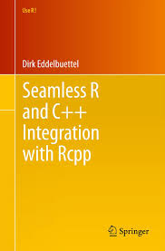
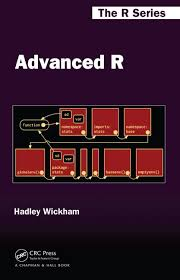
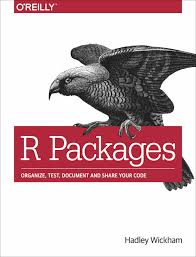
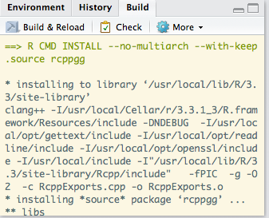

---
title: "An Introduction to `R` Package Development with Rcpp"
author: "Andee Kaplan"
ratio: 16x10
output:
  rmdshower::shower_presentation:
    self_contained: false
    katex: true
    theme: ribbon
---    

#An Introduction to `R` Package Development with Rcpp

## Resources





- [http://rcpp.org/](http://rcpp.org/)
- [http://adv-r.had.co.nz/](http://adv-r.had.co.nz/)
- [http://r-pkgs.had.co.nz/](http://r-pkgs.had.co.nz/)

## Installation

1. Setup `R` for development
    - Mac OSX: Install XCode Developer tools from the App Store
    - Windows: Install RTools from https://cloud.r-project.org/bin/windows/Rtools/
    - Linux: Install the core software development utilities
      `sudo apt-get install r-base-dev`
2. Then install the `R` Packages `Rcpp` and  `RcppArmadillo`
    `install.packages(c("Rcpp", "RcppArmadillo"))`
3. `devtools::has_devel()`

## Getting started

`cppFunction()` allows you to write C++ functions in `R`.

```{r}
library(Rcpp)
cppFunction(
  'int add(int x, int y, int z) {
    int sum = x + y + z;
    return(sum);
  }'
)

add
add(1, 2, 3)
```

## `Rcpp` types

- **Scalars**: `int`, `double`, `String`, `bool`
- **Vectors**: `IntegerVector`, `NumericVector`, `CharacterVector`, `LogicalVector`
- **Matrices**: `IntegerMatrix`, `NumericMatrix`, `CharacterMatrix`, `LogicalMatrix`
- **R output**: `List`, `DataFrame`

Still use `[]` for accessing elements in `Rcpp` vectors, but `()` for accessing alements in `Rcpp` matrices. 

## `sourceCpp`

Can use standalone C++ files with extension `.cpp` and source them into `R` using `sourceCpp()`. If you do this, must include
```cpp
#include <Rcpp.h>
using namespace Rcpp;
```
at the top of your C++ file and for each function that you want to use in `R`, prefix it with 
```cpp
// [[Rcpp::export]]
```

Then, you can source your function using

```{r}
sourceCpp("code/timesTwo.cpp")
timesTwo(1:10)
```


## Package Skeleton


## Workflow

After editing/creating your package, 
    
1. Generate the necessary documentation changes with `devtools::document()`
2. Build and reload your packages
    



## `RcppArmadillo`

[Armadillo](http://arma.sourceforge.net/) is a C++ linear algebra library aiming towards a good balance between speed and ease of use. We can use the `R` package `RcppArmadillo` to interface with this library.

- **DESCRIPTION**: `LinkingTo: Rcpp, RcppArmadillo`
- **`.cpp` file**: 
    
```cpp
#include <RcppArmadillo.h>
// [[Rcpp::depends(RcppArmadillo)]]
using namespace Rcpp; using namespace arma;
```


