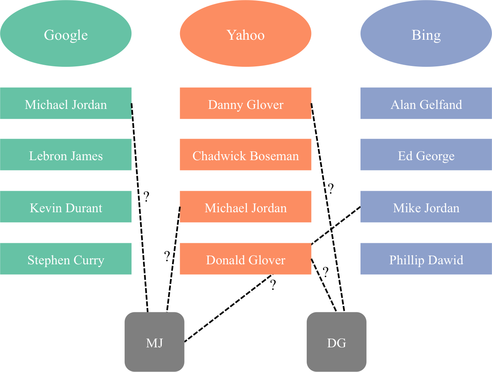

```{r libraries, echo=FALSE, message=FALSE, warning=FALSE}
library(knitr) # tables
library(ggplot2) # plots
library(readr) # read data
library(dplyr) # data manipulation
library(tidyr) # data manipulation
library(charlatan) # make fake data
library(salty) # distort data
library(kableExtra) # fancy tables

opts_chunk$set(echo=FALSE, message=FALSE, warning=FALSE) # don't print code etc.
theme_set(theme_bw(base_family = "serif", base_size = 20)) # black and white theme plots

set.seed(1234) # reproducible
```

# Outline

1. Record linkage and the downstream task  
    What is record linkage, and how is it useful?
\vfill
1. Representative records  
    How to represent a linked dataset via prototyping?
\vfill
1. Results  
    How well does prototyping work for different data situations and downstream tasks?
\vfill
1. Prototyping in practice  
    Some guidelines for using prototyping and directions for future work
\vfill
1. Other work   
    What else have I been up to?
\vfill

----

\begin{center}
\Huge
Record Linkage and the downstream task \\
\end{center}

# What is record linkage?

\vfill
> Record linkage is the process of merging noisy databases to remove duplicate entities without the use of a unique, identifying attribute

\vfill

# Records to link

```{r}
fake_insurance <- ch_generate(locale = "en_US", n = 5) # example fake data
fake_medical <- read_csv("../resources/data/diabetes.csv")
names(fake_medical)[3] <- "BP"

fake_bills <- ch_double(n = 5, mean = 10000, sd = 10000)
fake_clients <- data.frame(name = fake_insurance$name, bill = fake_bills*(fake_bills > 0))

fake_patients <- bind_cols(Name = salt_letters(salt_ocr(fake_insurance$name, p = .5, rep_p = 1), p = .5), 
                          fake_medical[sample(seq_len(nrow(fake_medical)), 5), c("Glucose", "BP", "Insulin", "Age")])
```

```{r}
kable(fake_clients, digits = 2) %>% kable_styling() %>% row_spec(0, bold = T)
```

```{r}
kable(fake_patients) %>% kable_styling() %>% row_spec(0, bold = T)
```

# Link on names?

```{r}
display_names <- bind_cols(`Client name` = fake_clients$name, `Patient name` = fake_patients$Name)
highlight <- which(display_names$`Client name` != display_names$`Patient name`)

kable(display_names) %>%
  kable_styling() %>%
  row_spec(0, bold = T) %>%
  row_spec(highlight, color = "#D7261E")
```

# Probabilistic record linkage

Put lit review here

# Probabilistic record linkage

```{r, out.height = "2.25in", fig.align="center"}

```

# Latent clustering approach

```{r, out.height = "3in", fig.align="center"}

```

# Bayesian hierarchical model

Proposed by @steorts2015entity with a package on CRAN (`blink`) [@blink]

```{r, out.height = "2.5in", fig.align="center"}
knitr::include_graphics("../resources/images/recordLinkage_graphicalModel.pdf")
```

# Downstream task


----
\begin{center}
\Huge
Representative records  \\
\end{center}

----
\begin{center}
\Huge
Results  \\
\end{center}

----
\begin{center}
\Huge
Prototyping in practice  \\
\end{center}

----
\begin{center}
\Huge
Other work  \\
\end{center}


# Thank you

* Slides -- <http://bit.ly/kaplan-ncsu-2018>
* Contact
    * Email -- <andrea.kaplan@duke.edu>
    * Web -- <http://andeekaplan.com>
    * GitHub -- <http://github.com/andeek>


---

\begin{center}
\Huge
Appendix \\
\end{center}

\appendix


# Appendix Slide

# References {.allowframebreaks}
\tiny
